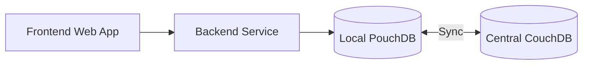
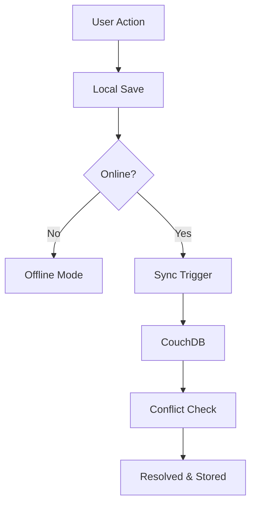
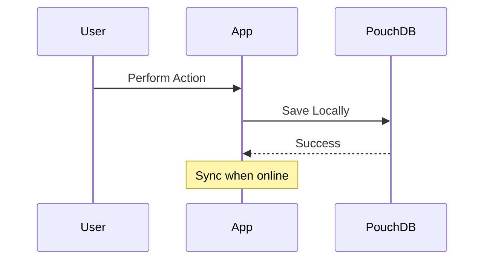

# METMMA Pharmacy Management System
## Synchronization Strategy (system-sync.md)

---

## 1. Introduction

### 1.1 Purpose
This document defines the synchronization strategy for the **METMMA Pharmacy Management System (MPMS)**. The strategy ensures reliable operation in environments with intermittent or no internet access by adopting an **offline‑first architecture**.

The system uses **PouchDB** for local storage and **CouchDB** for centralized backup and synchronization. This approach ensures:

- Continuous operation during network outages
- Reliable data replication
- Secure and auditable synchronization
- Scalability for future multi-branch deployment

### 1.2 Scope
This document covers:

- Local data storage using PouchDB
- Bidirectional synchronization with CouchDB
- Offline-first workflow
- Conflict detection and resolution
- Security and integrity controls

**Out of Scope**:
- Real-time multi-branch stock sharing
- Centralized live inventory updates

> Each pharmacy branch operates independently. Cloud sync is primarily for backup, reporting, and future expansion.

### 1.3 References
- MPMS Requirements Specification
- https://pouchdb.com
- https://couchdb.apache.org

### 1.4 Assumptions
- Each pharmacy has a dedicated PC or local server
- Internet connectivity is intermittent
- A central CouchDB instance is cloud-hosted
- Local users authenticate offline
- Sync privileges are restricted to administrators

---

## 2. Objectives

| Objective | Description |
|----------|-------------|
| Offline Operation | Full functionality without internet |
| Data Integrity | Prevent data loss and corruption |
| Secure Sync | Encrypted communication and verification |
| Scalability | Support future multi-branch rollout |
| Reliability | Automatic retries and conflict handling |

---

## 3. Architecture Overview

### 3.1 System Architecture



### 3.2 Architecture Layers

| Layer | Responsibility |
|------|----------------|
| Frontend | UI, offline UX, data entry |
| Backend | Business logic, validation |
| Local DB | Offline storage (PouchDB) |
| Sync Layer | Data replication |
| Central DB | Backup and analytics |

---

## 4. PouchDB Integration

### 4.1 Local Databases

| Database | Purpose |
|---------|--------|
| sales_db | Transactions and receipts |
| stock_db | Inventory and batches |
| hr_db | Staff records |
| reports_db | Generated reports |
| users_db | Auth & roles (encrypted) |

### 4.2 Data Model

All documents follow this structure:

```json
{
  "_id": "uuid",
  "_rev": "revision",
  "type": "sale | stock | user",
  "branch_id": "MET-001",
  "created_at": "ISO_DATE",
  "updated_at": "ISO_DATE"
}
```

### 4.3 Local Setup Example

```js
const PouchDB = require('pouchdb');

const localDB = new PouchDB('stock_db');
const remoteDB = new PouchDB('https://server/stock_db');

localDB.sync(remoteDB, { live: true, retry: true });
```

---

## 5. Synchronization Strategy

### 5.1 Sync Modes

| Mode | Description |
|------|-------------|
| Live Sync | Continuous background sync |
| Manual Sync | Admin-triggered |
| Filtered Sync | Partial data replication |

### 5.2 Sync Flow



### 5.3 Sync Events

- `change` → data updated
- `paused` → offline detected
- `active` → syncing
- `error` → retry with backoff

---

## 6. Conflict Resolution

### 6.1 Detection
PouchDB flags conflicts using revision trees (`_conflicts`).

### 6.2 Resolution Strategies

| Data Type | Strategy |
|----------|----------|
| Sales | Append-only (immutable) |
| Stock | Timestamp + audit trail |
| HR | Central authority wins |

### 6.3 Resolution Example

```js
localDB.sync(remoteDB).on('change', async info => {
  if (info.change.docs.some(d => d._conflicts)) {
    const doc = await localDB.get(id, { conflicts: true });
    const winner = resolve(doc._conflicts);
    await localDB.put(winner);
  }
});
```

---

## 7. Data Integrity & Security

### 7.1 Security Controls

- HTTPS for all sync operations
- Encrypted sensitive fields
- Role-based access control
- Webhook verification

### 7.2 Data Protection

| Feature | Method |
|------|-------|
| Encryption | AES / crypto-js |
| Backup | CouchDB replication |
| Auditing | Change logs |
| Validation | Schema enforcement |

---

## 8. Offline-First Logic

- All writes go to local DB
- Sync occurs automatically
- UI indicates offline state
- No blocking of transactions

### Offline Behavior



---

## 9. Implementation Guidelines

### Technology Stack

- Frontend: HTML / JS / React
- Backend: Node.js / Express
- Database: PouchDB + CouchDB
- Hosting: Docker / VPS

### Best Practices

- Compact DB regularly
- Use indexed queries
- Log sync activity
- Validate before syncing

---

## 10. Testing & Monitoring

### Testing

- Offline simulation
- Sync interruption tests
- Conflict resolution tests

### Monitoring

- Sync duration
- Error frequency
- Data growth

---

## 11. Risks & Mitigation

| Risk | Mitigation |
|------|------------|
| Data loss | Replication & backups |
| Conflicts | Revision resolution |
| Security breach | Encryption + RBAC |
| Sync failure | Retry & logging |

---
